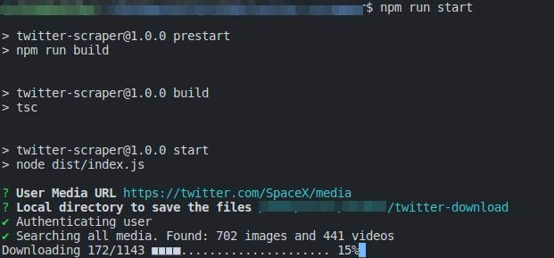

# X (old Twitter) Scraper

A "X" (old Twitter) [scraper](https://pt.wikipedia.org/wiki/Coleta_de_dados_web) with Node.js and Puppeteer to automatically sign-in and download user media.

## Features

- Automated sign-in.
- Automated search for user media and download them. Supports image/videos, albums and "X" pagination.

## How to install and run:
- You need to have Node.js >= v16 and TypeScript installed.
- Clone the repository: `git clone https://github.com/ArturMiguel/twitter-scraper`
- Install the dependencies: `npm ci`
- Rename `.env.template` to `.env` and put your credentials.
- Start the application: `npm run start`

## Disclaimer

This is a test repository for personal use, all content collected from "X" is public and accessed by any user, i just automated this process.

If you want to use "X" services commercially or professionally, i recommend the official X API https://developer.x.com/en/docs/x-api.

## License

[MIT](LICENSE)